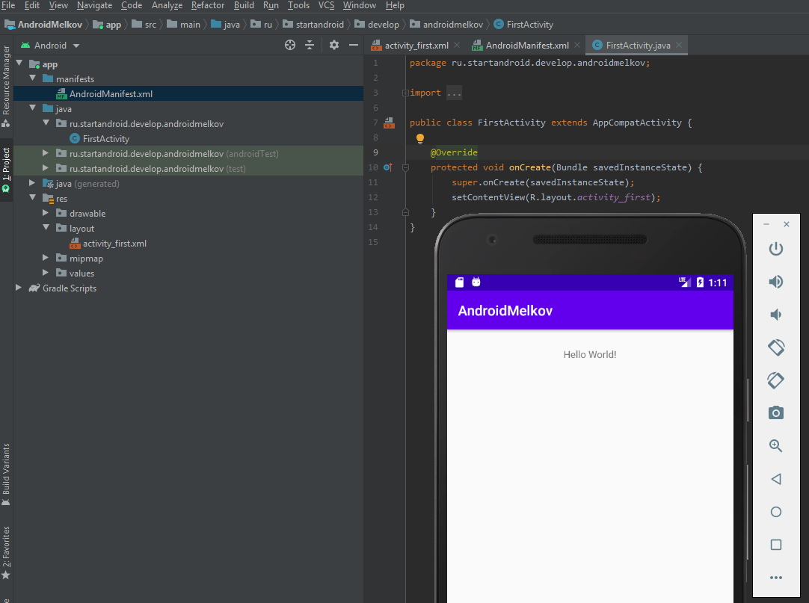
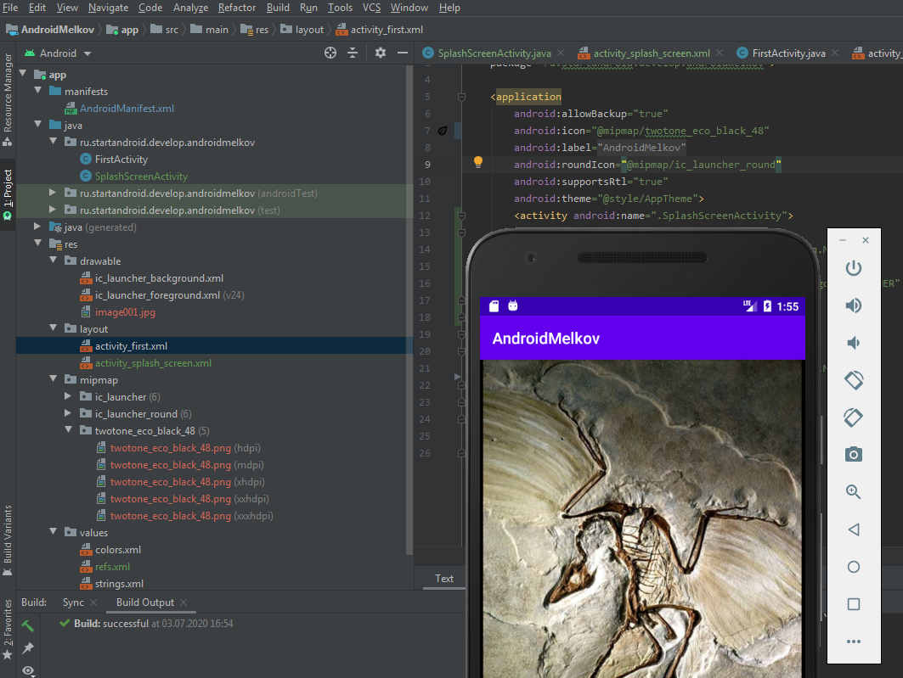

## AndroidMelkov
### Задача №1: Первый Android проект
commit: 3e463d

Это Ваше первое приложение на Android. Для начала разработки Android приложений необходимо установить Android Studio и изучить работу с ней. Это и предстоит сделать в первой задаче.
**Задание**: Нужно создать Ваш первый проект в Android Studio со следующими параметрами:
- Имя проекта: AndroidLastname, где Lastname - Ваша фамилия в транслитерации
- Версия API проекта должна быть установлена "API 22: Android 5.1 (Lollipop)" и выбрано SDK* только для "Phone and Tablet" (возможно на этом шаге или по завершении работы мастера создания проекта в течении некоторого времени будет загружена версия API)
- Тип первого экрана приложения - "Empty Activity"
- Имя первого экрана FirstActivity После создания проекта, нужно повестить имеющуюся надпись наверх окна. Созданное приложение запустить на своём смартфоне.

### Задача №2: Собственный Hello world
Теперь модифицируем разработанное в первом задании приложение.
Задание:
- Нужно добавить стартовый экран для приложения
- На стратовый экран поместить картинку
- Установить созданный экран в качестве стартового
- Установить иконку приложения

